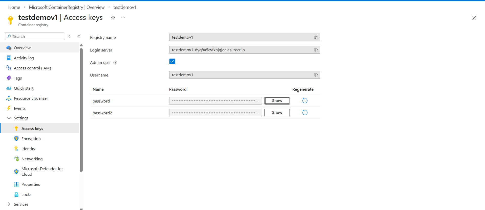
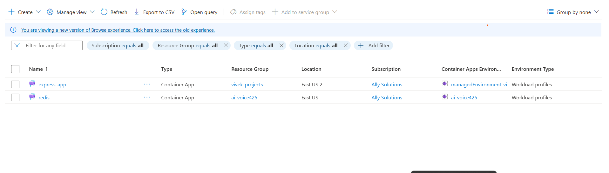
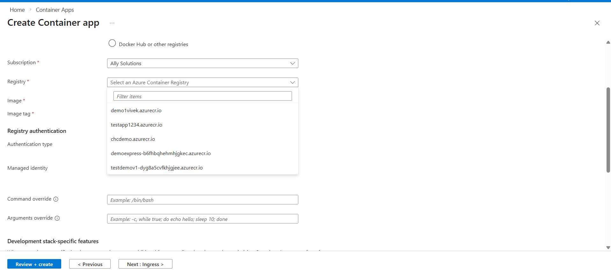
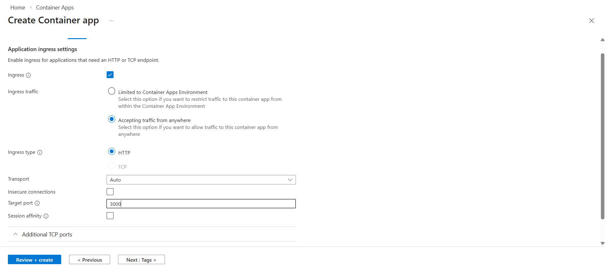
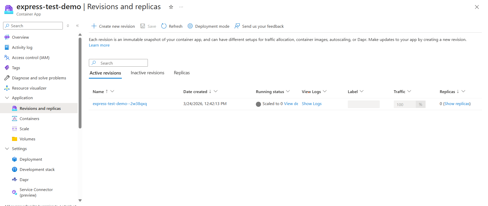

### Steps to run the project

Clone the repository

```bash
git clone https://github.com/uchiha-vivek/Azure-Container-Apps.git .
```

Install the dependencies

```bash
npm install
```


Run the server

```bash
npm run start
```


Dockerfile

```
FROM node:18-alpine

WORKDIR /app

COPY package*.json ./
RUN npm install

COPY . .

ENV PORT=3000

EXPOSE 3000

CMD ["npm", "start"]

```


### Open Container Registry in Azure  (Azure Container Registry)


1. Create container Registry from Azure 

2. Build the docker image

```bash
docker build -t  testdemov1-dyg8a5cvfkhjgjee.azurecr.io/express-demo-app:v1 .
```

`testdemov1-dyg8a5cvfkhjgjee.azurecr.io` is the login server which you will get after you create container registry

`express-demo-app` is the repository name within the registry

`v1` is the tag(version) for the image


3. Run the docker login command


For login you will get the credentials from `Settings > Access Keys`, Enable Admin user and then you will get `username` and `password`

<p align="center">
  <a href="">
    
  </a>
</p>


```bash
docker login testdemov1-dyg8a5cvfkhjgjee.azurecr.io
```

4. Push the docker image

```bash
 docker push testdemov1-dyg8a5cvfkhjgjee.azurecr.io/express-demo-app:v1  
 ```


## Container Apps


1. Create new container app

<p align="center">
  <a href="">
    
  </a>
</p>


<p align="center">
  <a href="">
    
  </a>
</p>


- Try to select resource group same as the one where you created container registry


2. Enable the ingress

<p align="center">
  <a href="">
    
  </a>
</p>

 - Enable accepting traffic from anywhere
 - Ingress type should be `http`
 - Select Target PORT to `3000`


 3. After you create the Container App , you will get Application url. This link will be the deployed server

 4. From Revision and Replicas you can clearly see the logs 

 This needs to be configured according to the application usecase

 <p align="center">
  <a href="">
    
  </a>
</p>


[Azure Container Registry](https://learn.microsoft.com/en-us/azure/container-registry/container-registry-intro)


[Azure Container App](https://learn.microsoft.com/en-us/azure/container-apps/overview)


Author - [Vivek Sharma](https://www.linkedin.com/in/vivekuchiha/)